# 🚗 Driving License Management System (DVLD)

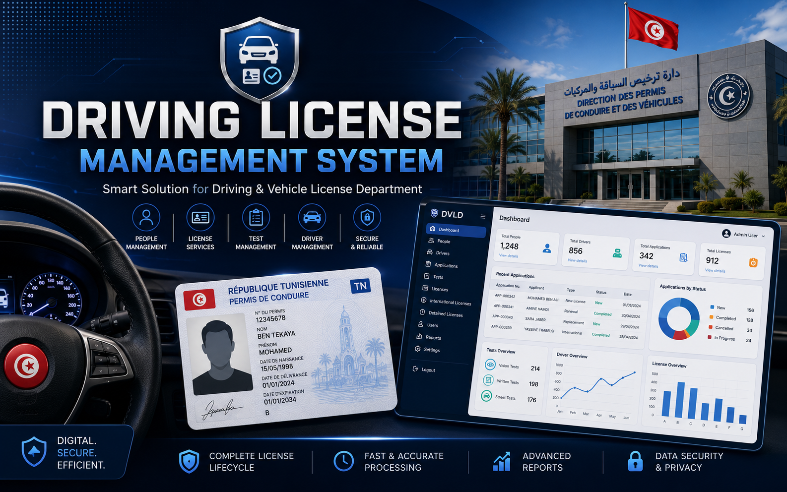

A complete desktop application developed in **C# (.NET Framework)** using **Windows Forms** and **SQL Server** for managing driving license services inside a Driving & Vehicle License Department (DVLD).

The application automates the complete licensing workflow, from registering citizens to issuing, renewing, replacing and managing driving licenses.

---

# Features

## 👤 People Management

- Add new people
- Edit existing people
- Delete people
- Search using National Number
- Store personal photo
- Prevent duplicate national numbers

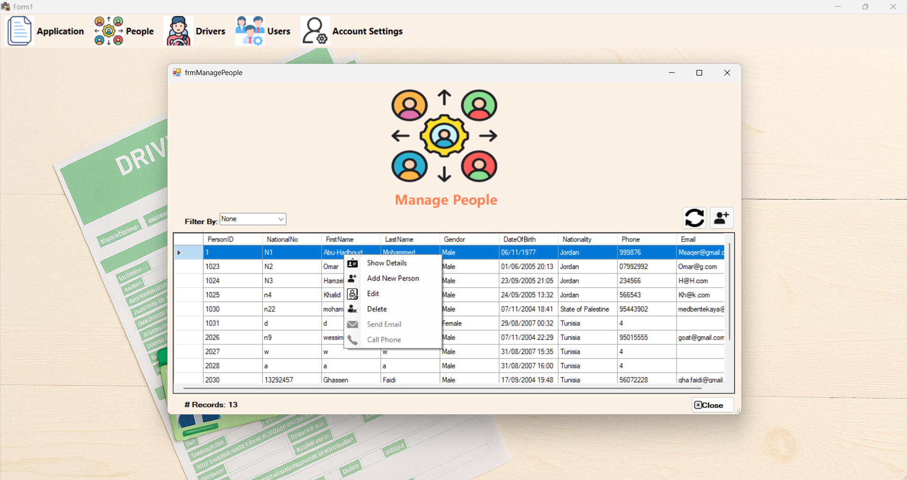

---

## 👥 User Management

- Add users
- Update users
- Delete users
- Activate / Deactivate accounts
- Password hashing
- User permissions
- Login system
- Last login tracking

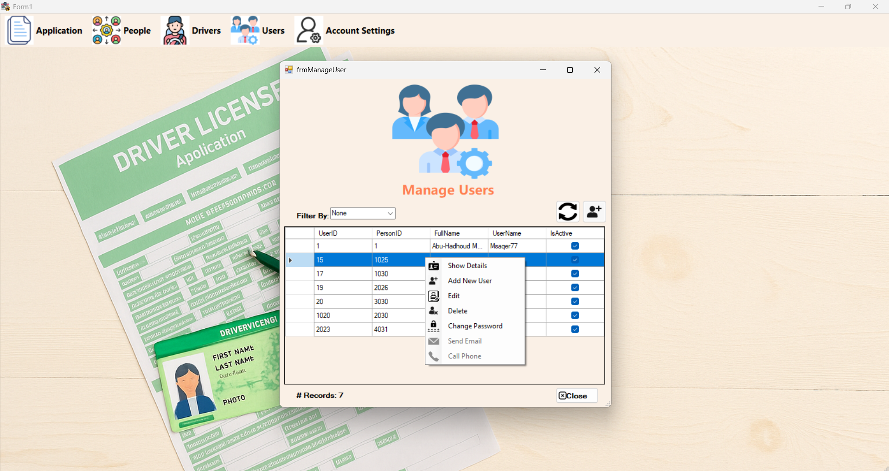

---

## 📋 Local Driving License Applications

Manage applications for first-time driving licenses.

Features include:

- Create applications
- Validate applicant age
- Prevent duplicate active applications
- Link applications to people
- Application status management

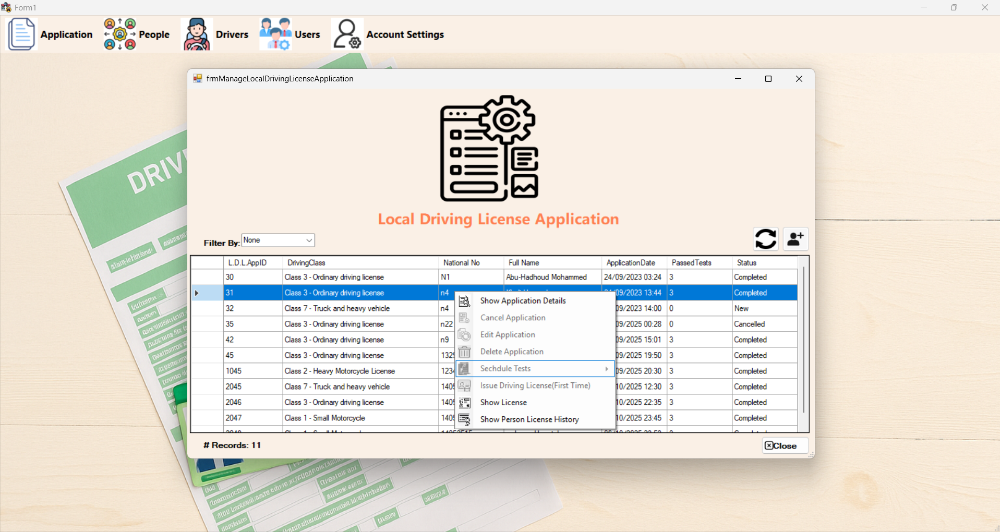

---

## 🚦 Driving Tests

The application supports the complete testing workflow.

### Vision Test

- Schedule appointment
- Record result
- Retry failed test

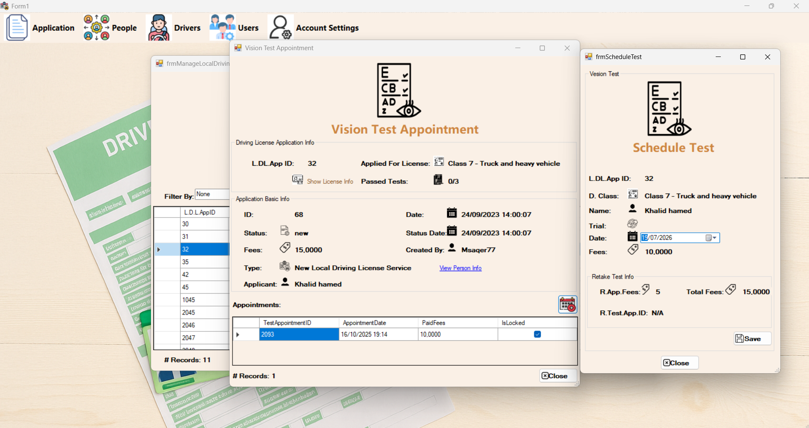

---

### Written Test

- Schedule written exam
- Record score
- Pass / Fail

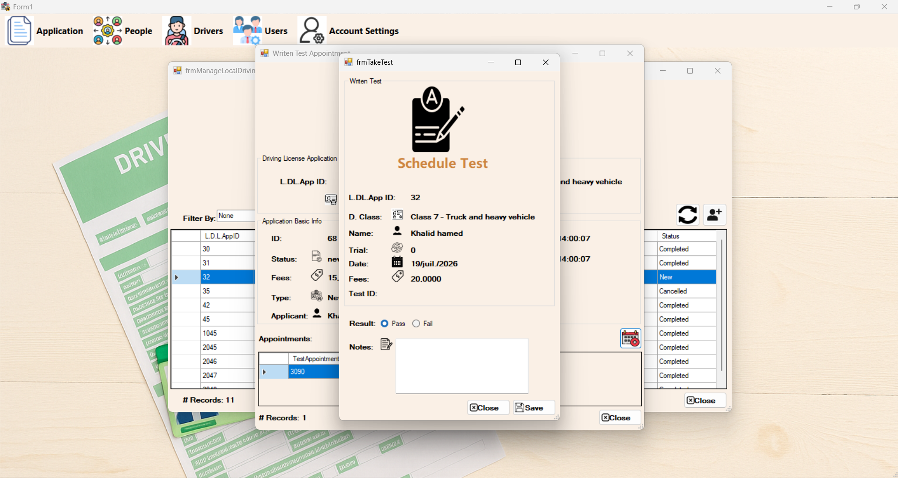

---

### Street Test

- Schedule practical driving test
- Record result
- Retry failed attempts

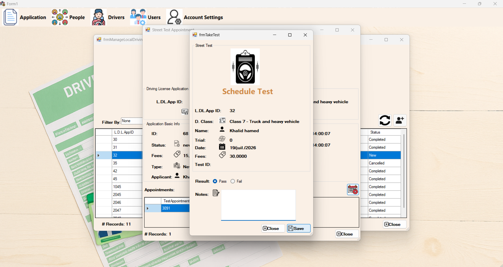

---

## 🪪 License Issuing

Issue a driving license after passing all required tests.

The system automatically validates:

- Minimum age
- Existing licenses
- Test completion
- Application status

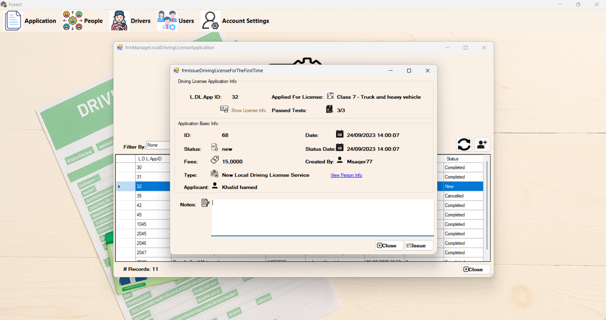

---

## 🆔 Driving License Card

View detailed license information.

Displayed information includes:

- License Number
- Driver Information
- License Class
- Issue Date
- Expiration Date
- Notes
- Active Status

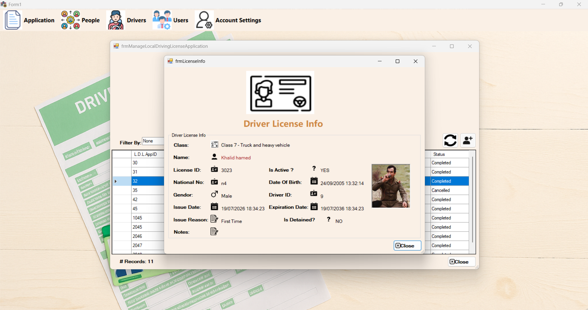

---

## 🌍 International License

Issue international licenses for eligible drivers.

Rules implemented:

- Only Class 3 licenses
- License must be active
- License must not be detained
- Prevent duplicate active international licenses

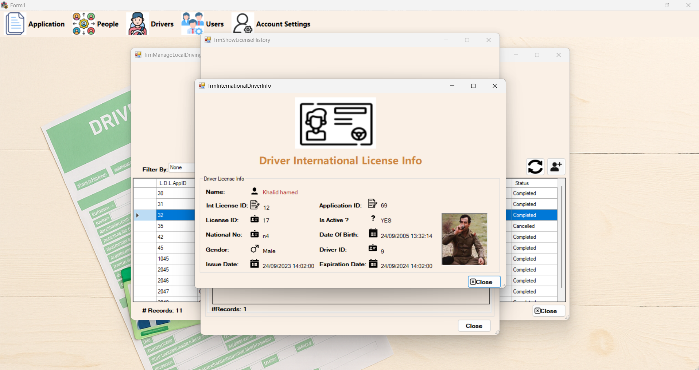

---

## 🔄 License Renewal

Renew expired licenses.

Features:

- Automatic fee calculation
- Expiration validation
- Vision test validation
- New license generation

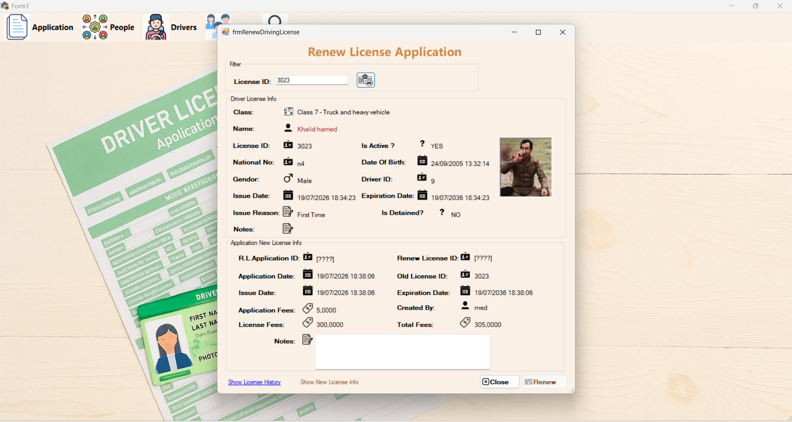

---

## 📄 Replacement Licenses

Support for:

- Lost licenses
- Damaged licenses

The system keeps the history of all replacements.

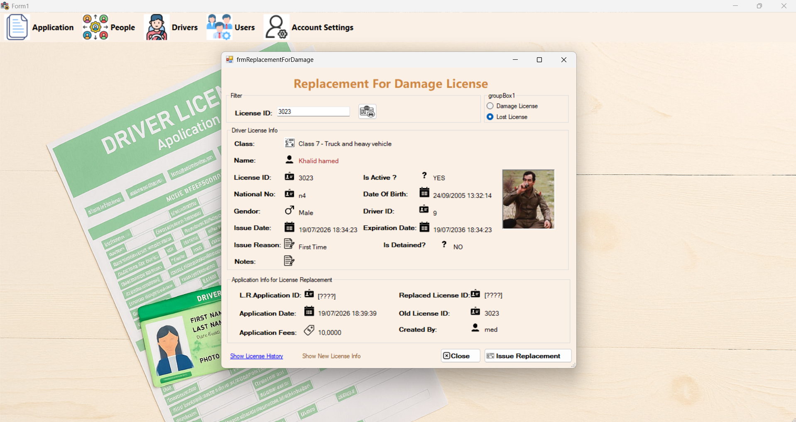

---

## 🚓 Detained Licenses

Detain licenses.

Features:

- Register detention
- Store detention reason
- Register fine
- Track detention history

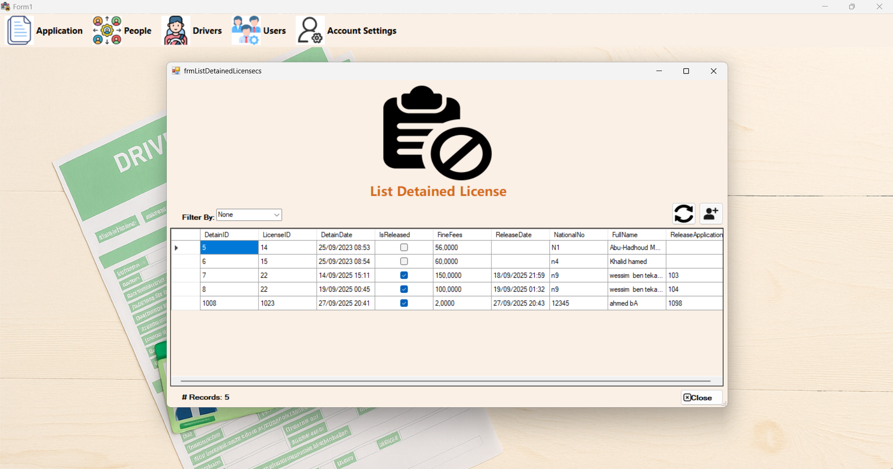

---

## ✅ Release Detained License

Release detained licenses after paying fines.

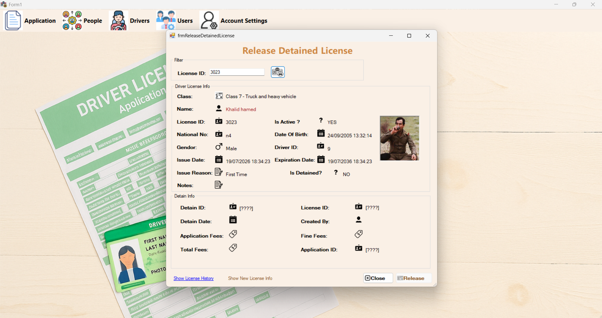

---

## 🚘 Driver Management

Once a license is issued, the person automatically becomes a registered driver.

Features:

- Driver history
- License history
- International license history

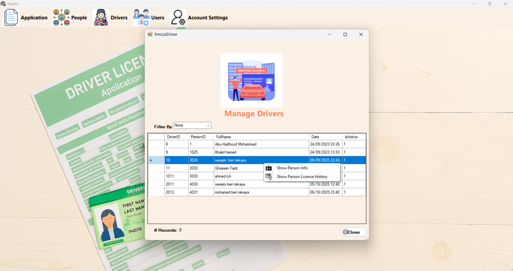

---

## ⚙ Administration

### Application Types

Modify application fees.

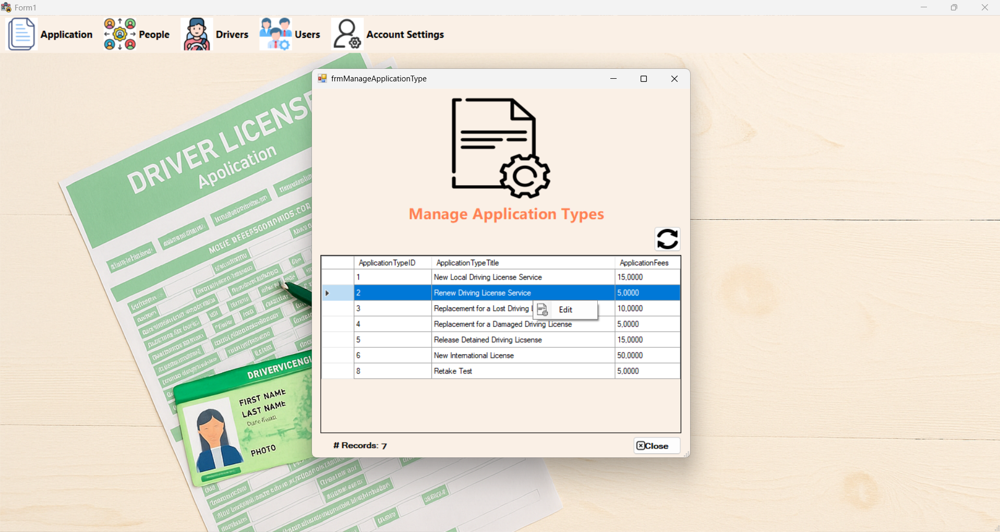

---

### Test Types

Modify testing fees.

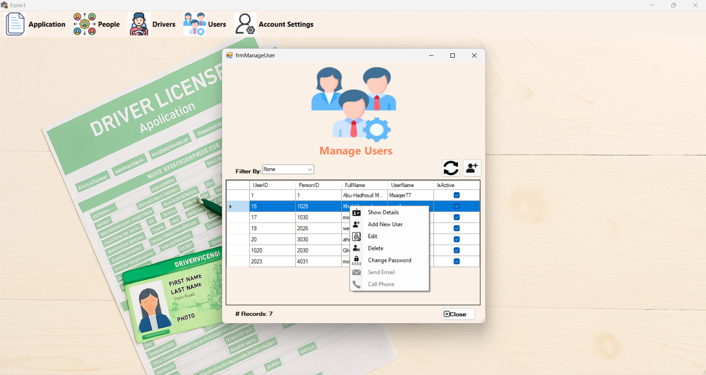

---

# Business Rules

The system implements more than 40 business rules, including:

- Minimum age validation
- Duplicate application prevention
- Duplicate license prevention
- Sequential test workflow
- License expiration validation
- License detention validation
- Replacement validation
- International license eligibility
- Automatic driver creation
- Complete application history
- User activity logging
- Password hashing

---

# Technologies Used

- C#
- Windows Forms
- .NET Framework
- SQL Server
- ADO.NET
- Layered Architecture (3-Tier)
- Object-Oriented Programming

---

# Architecture

```
Presentation Layer
        │
        ▼
Business Layer
        │
        ▼
Data Access Layer
        │
        ▼
SQL Server Database
```

---

# Database

The application uses a relational SQL Server database designed to support the complete licensing workflow.

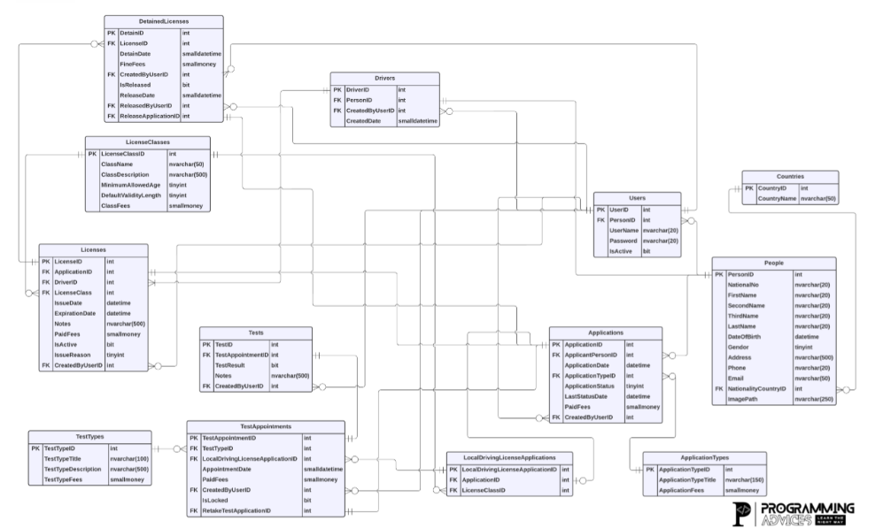

---

# Project Statistics

- 20+ Windows Forms
- 100+ Classes
- Complete CRUD Operations
- Multi-layer Architecture
- Authentication System
- Driving Test Workflow
- License Issuing Workflow
- Driver Management
- International Licenses
- Renewal System
- Detained Licenses
- Event Logging
- Password Hashing

---

# Future Improvements

- Barcode / QR Code licenses
- Email notifications
- Online appointment booking
- Digital license generation
- REST API
- Role-based authorization
- Reporting Dashboard

---

# Author

**Mohamed Ben Tekaya**

Computer Science Student
